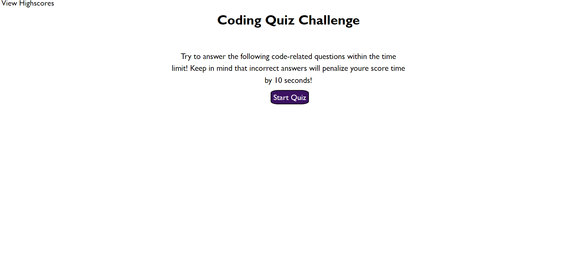

# Running-Quiz

## Description
Open the html to start the Quiz, keep clicking on the choice after reading them through 
Once the timer start counting it can show either right or wrong and show you the score at the end.

## Purpose

With this app we can create code quiz that:
1. has a limited time
2. has a high score board that can be cleared by the user 
3. cycles through multiple screens when the answers are given
4. subtract 10 seconds when the wrong answer is given

## Built With

* HTML
* CSS
* JavaScript

## Screen Shot

# Links

# Contribution

Nardos Abraha

